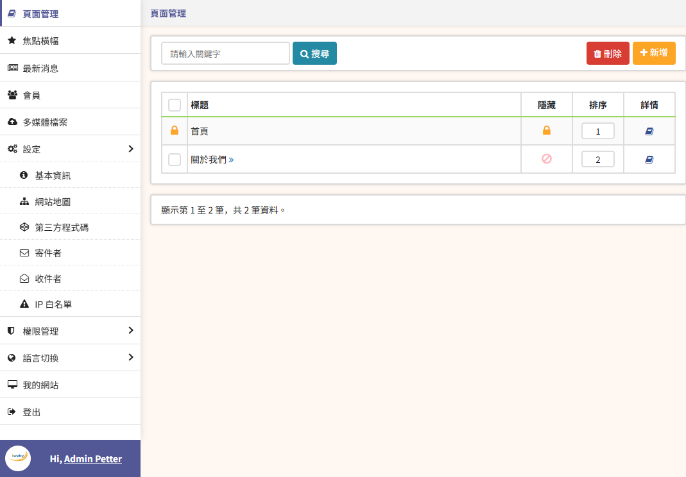

**Description:**  
A battle-tested Laravel development kit for rapid project setup. Build websites and web apps faster with dynamic routing, reusable components, and built-in CMS features.

**Highlights:**

-   ⚡ **Rapid Development:** Pre-built core and utilities to jumpstart projects.
    
-   🛠️ **CMS Features:** Pages, posts, media library, and content management.
    
-   🔑 **User & Role Management:** Admin panel for users, roles, and permissions.
    
-   🌐 **SEO & Routing:** SEO-friendly defaults with dynamic route handling.
    
-   📧 **Email Ready:** Configurable SMTP and SendGrid integration.
    
-   🗄️ **Reusable Tools:** Session, cookie, and data utilities used in multiple live projects.
    

**Perfect for:** Developers who want a solid Laravel foundation to launch projects quickly without reinventing the wheel.

## Frond End:
https://xxxx.com/

## Back End:
https://xxxx.com/admin
Backend user: admin / Abc123

## Setup:

### 1. Create DB & import defaultcms.sql

### 2. Change db (file: .env)
	DB_CONNECTION=mysql
   	DB_HOST=127.0.0.1
   	DB_PORT=3306
   	DB_DATABASE=defaultcms
   	DB_USERNAME=root
   	DB_PASSWORD=
   	DB_TABLEPREFIX=app_

### 3. Change application config (file:  config/app_portal.php)
 
    // Version
   	$config['application_version'] = '1.0';
   
   	// unique ID, Generate a new key: php artisan key:generate
   	$config['application_uid'] = md5('default-website'); 
   	
   	....
   	
   	$config['support_lang'] = []
   	
   	.....

### 4. Naming Conventions:

	Controllers & Models (PHP classes):
	Each English word must start with a capital letter.
	If using underscores to connect words, the first letter of each word must also be capitalized.

	✅ Correct:
	Blog.php, Team_Member.php, Teammember.php

	❌ Incorrect:
	Team_member.php, TeamMember.php

	JS, CSS & View files:
	Use only lowercase letters.

### 5. How to deploy
	
	# Modify .env
	From "APP_ENV=local" to "APP_ENV=production"

	# Re-generate key
	php artisan key:generate 

	# Clear cache
	php artisan config:cache
	php artisan route:cache
	php artisan view:cache

	# Minify js & css
	node public/developer/compress-assets.cjs

	# Package the source code (excluding node_modules and public/developer)
	# Upload source code to server

	# Delete development files (optional)
	rm -rf tests
	rm -rf .git
	rm -rf .github
	rm -rf .vscode
	rm -rf .idea

	# Delete documentation (optional)
	rm -f CHANGELOG.md
	rm -f CONTRIBUTING.md
	rm -f UPGRADE.md
	rm -f README.md
	rm -f phpunit.xml
	rm -f .env.example

	# Set permissions
	find . -type d -exec chmod 755 {} \;
	find . -type f -exec chmod 644 {} \;
	chmod -R 755 storage
	chmod -R 755 bootstrap/cache
	chmod -R 755 public
	chmod 644 .env
